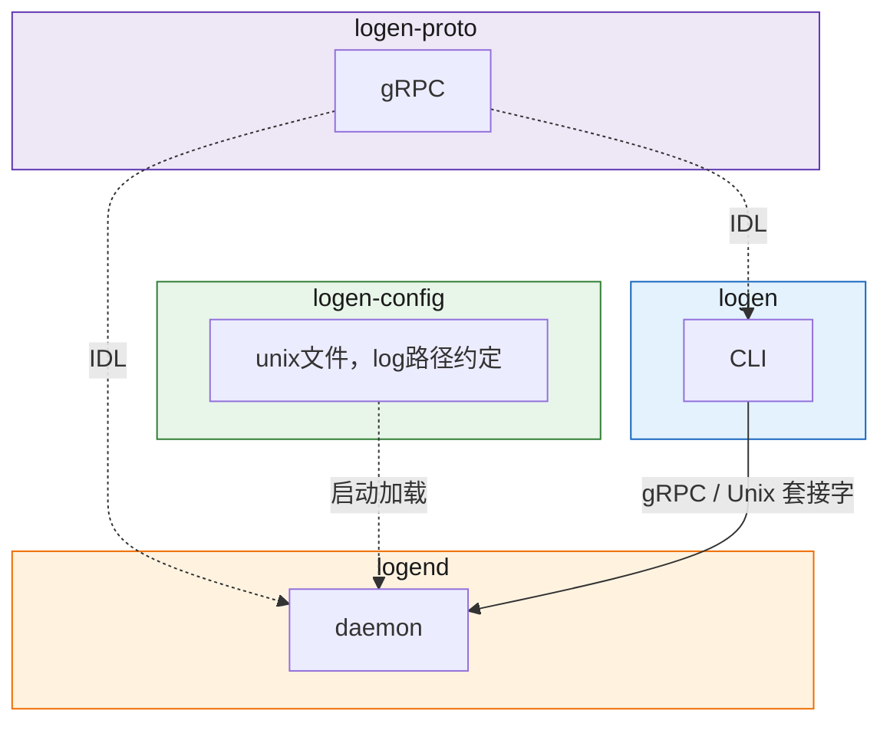
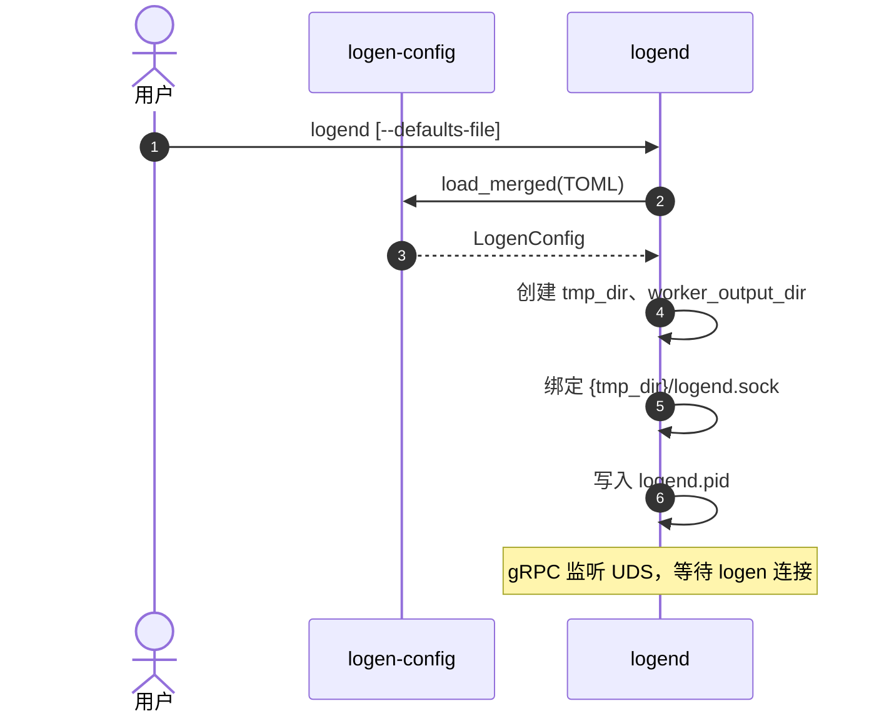
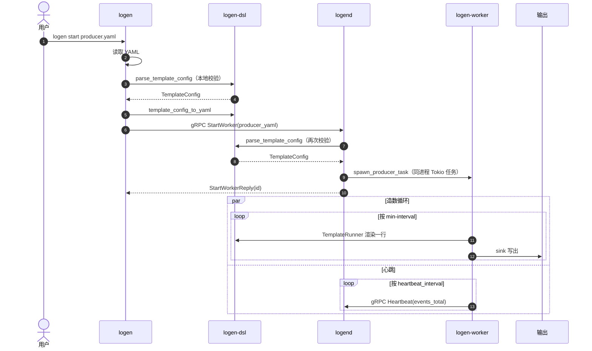

# logkit介绍

本项目旨在解放heka的奴役，以及对旧工具的改造

**thanks to: [logspout](https://github.com/jiwen624/logspout)**（本仓库已更名为 logen，与上游项目无隶属关系）

许可：**GPL-3.0**（见仓库根目录 [`LICENSE`](../../LICENSE)）。

## 架构示意

### 图 1：协议和通信

### 图 2：启动流程

先起 **`logend`**，再用 **`logen start`** 下发任务；造数在 daemon **进程内**由 `logen-worker` 执行（非子进程）。

#### 2a 启动 logend

#### 2b 启动造数（logen start）

## 模块文档

| 模块 | mdBook |
|------|--------|
| **logen-dsl** | [`logen-dsl/guide/book/index.html`](../../logen-dsl/guide/book/index.html) |