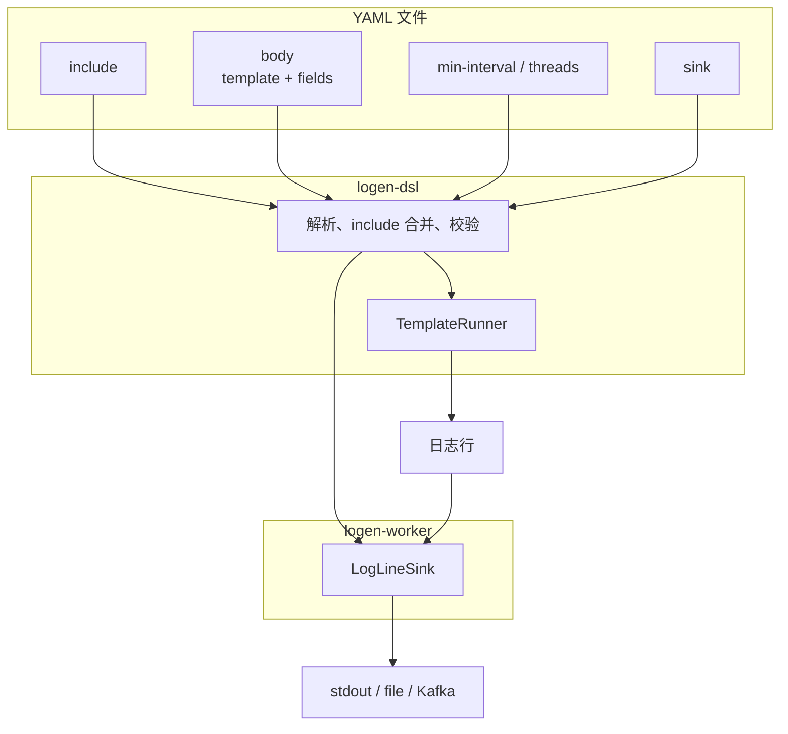

# 简介

**logen-dsl** 负责解析 **yaml** 文件。
**yaml** 文件是一份蓝图，它引导 worker 怎么造日志、造完往哪送。

一份 yaml 文件分为：

| 块 | 作用 |
|----|------|
| **`body`** | [渲染](render/index.md) |
| **`sink`** | [输出](sink/index.md) |
| **`min-interval`** | [速率](rate.md) |
| **`threads`** | [速率](rate.md) |
| **`include`** | 可选；按顺序引入其它 YAML 片段 |

## 举例

```yaml
body:
  template: '{{ts}} {{level}} {{msg}}'
  fields:
    ts:
      type: timestamp
      format: "%Y-%m-%dT%H:%M:%S%z"
    level:
      type: one-of
      branches:
        - { w: 3, v: info }
        - { v: warn }
    msg:
      type: sentence
      min: 3
      max: 8

min-interval: 1s

sink:
  type: stdout
```

## 架构


