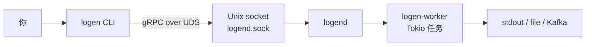

# 简介

**logen** 是面向 **`logend`** 的 **gRPC 客户端**：在 **Unix 域套接字**上连接守护进程，启动 / 查询 / 停止造日志 **worker 实例**。**仅支持 Unix**（无 Windows 套接字路径）。

CLI 本身不渲染日志、不写 Kafka；它把**实例 YAML**交给 daemon，由进程内的 **`logen-worker`** 执行。YAML 语法见 **[logen-dsl 规范](../../logen-dsl/guide/book/index.html)**（需先 `cd logen-dsl/guide && mdbook build`）。

## 与 logend 的关系



| 组件 | 角色 |
|------|------|
| **logend** | 监听套接字、管理实例生命周期、可选心跳与健康状态 |
| **logen** | 发 `start` / `stop`、查 `list` / `stat`、调试 `ping` / `echo` |
| **logen-config** | CLI 与 daemon **共用**的 TOML（`tmp_dir`、gRPC 消息大小、输出目录等） |

## 典型工作流

1. 启动 **`logend`**（见 [`logend` README](../../logend/README.md)）。
2. 编写实例 YAML（见 [logen-dsl](../../logen-dsl/guide/src/intro.md) 或仓库 [`etc/`](../../../etc/) 示例）。
3. **`logen start CONFIG.yaml`** → 得到实例 **id**。
4. **`logen list`** / **`logen stat`** 观察运行与吞吐。
5. **`logen stop <id>`** 结束实例。

## 构建本书

```bash
cd logen/guide
mdbook build
# 可选：mdbook serve --open
```

HTML 输出在 **`logen/guide/book/`**（已 `.gitignore`）。含 Mermaid 的页需先安装 **`mdbook-mermaid`** 预处理器，并在构建前执行仓库根目录 **`./scripts/fetch-mdbook-mermaid-assets.sh`**（`mermaid*.js` 不纳入 Git）。
